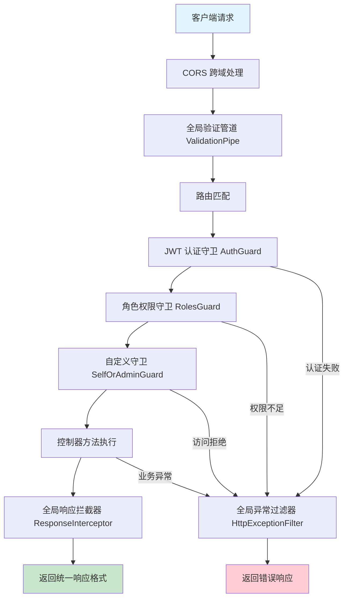
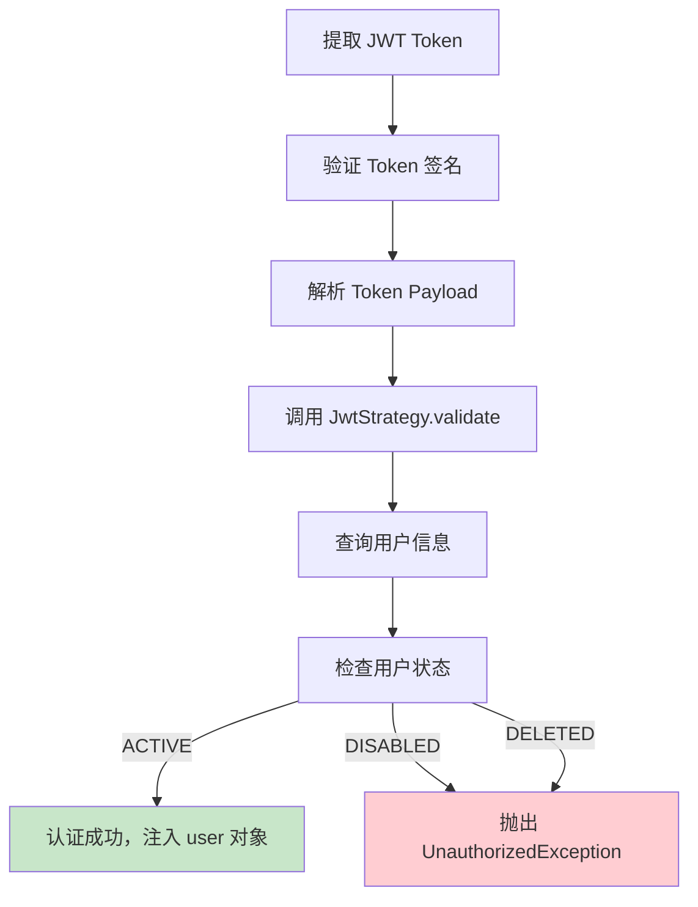
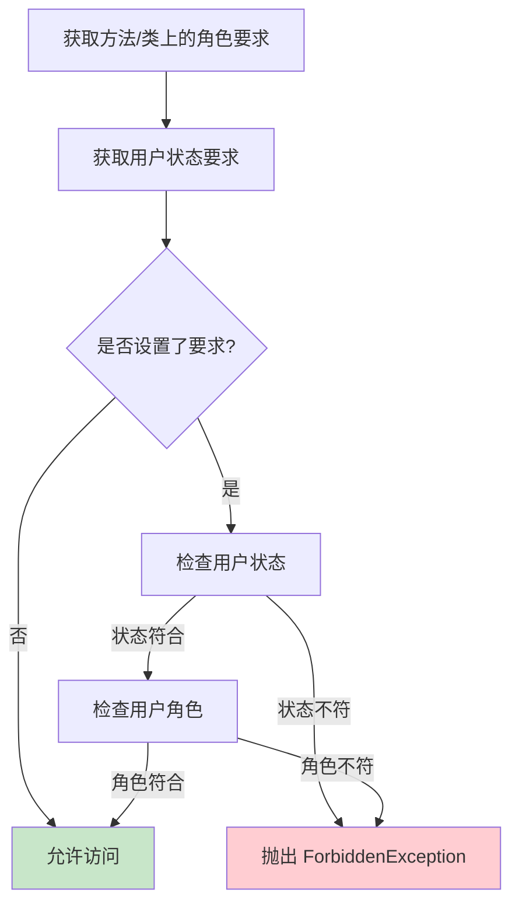
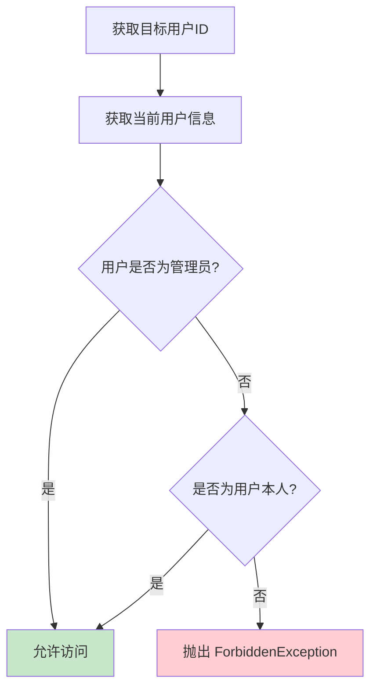
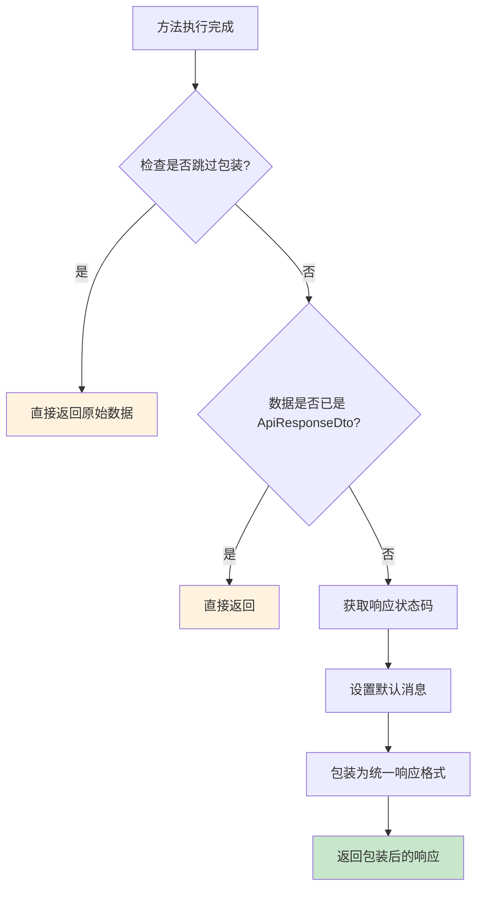
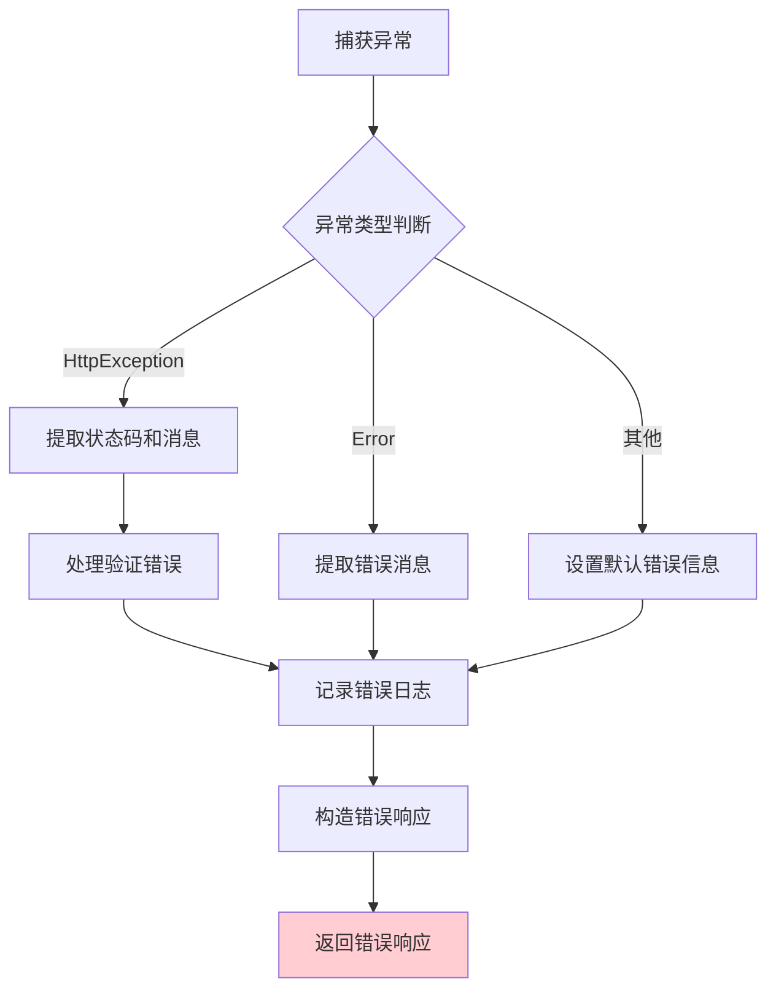
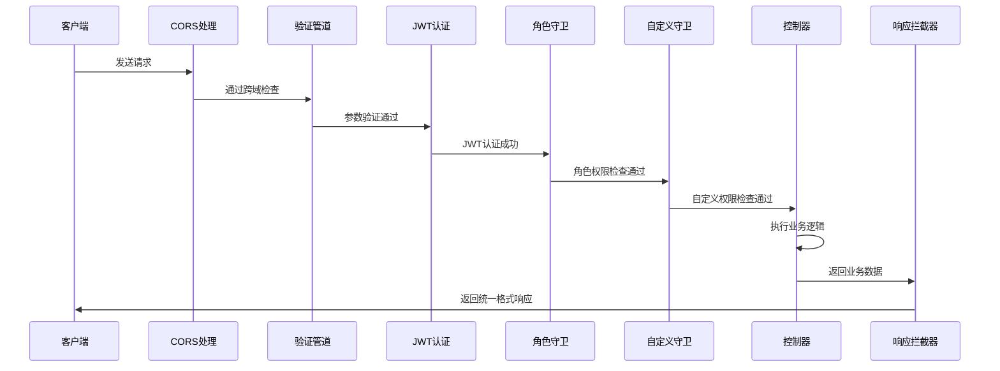
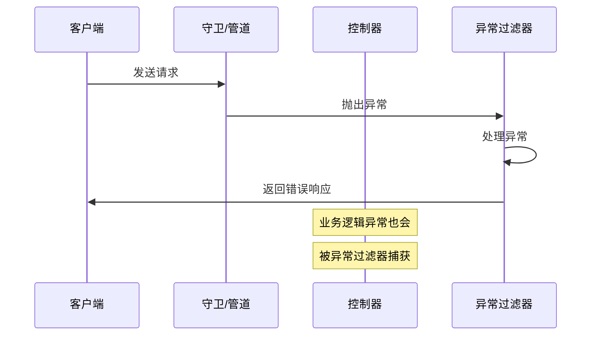

# NestJS 后端请求处理流程图

## 概述

本文档详细描述了 Typing API 项目中请求从进入后端到返回响应的完整处理流程，包括各种装饰器、守卫、拦截器和过滤器的作用及执行顺序。

## 整体架构流程图



## 详细组件说明

### 1. 全局配置 (SetupModule)

**位置**: `/src/modules/setup/setup.module.ts`

**作用**: 在应用启动时配置全局组件

```typescript
// 配置顺序
1. Swagger 文档配置
2. 全局验证管道 (ValidationPipe)
3. 全局响应拦截器 (ResponseInterceptor)
4. 全局异常过滤器 (HttpExceptionFilter)
5. CORS 跨域配置
```

### 2. 请求验证层

#### 2.1 全局验证管道 (ValidationPipe)

**作用**: 
- 自动验证请求参数
- 类型转换
- 移除未定义的属性
- 拒绝包含非白名单属性的请求

**配置**:
```typescript
new ValidationPipe({
  whitelist: true,           // 只保留 DTO 中定义的属性
  forbidNonWhitelisted: true, // 拒绝包含额外属性的请求
  transform: true,           // 自动类型转换
})
```

### 3. 认证与授权层

#### 3.1 JWT 认证守卫 (AuthGuard)

**位置**: `@UseGuards(AuthGuard('jwt'))`

**执行流程**:


**JWT 策略验证逻辑**:
```typescript
// 用户状态检查
if (user.status === UserStatus.DISABLED) {
  throw new UnauthorizedException('账户已被禁用');
}
if (user.status === UserStatus.DELETED) {
  throw new UnauthorizedException('账户不存在');
}
```

#### 3.2 角色权限守卫 (RolesGuard)

**位置**: `/src/common/guards/roles.guard.ts`

**装饰器**: `@Roles(Role.ADMIN, Role.SUPER_ADMIN)`

**执行逻辑**:


**相关装饰器**:
- `@Roles(...roles: Role[])`: 设置角色要求
- `@RequireUserStatus(...statuses: UserStatus[])`: 设置用户状态要求

#### 3.3 自定义守卫 (SelfOrAdminGuard)

**位置**: `/src/common/guards/self-or-admin.guard.ts`

**使用场景**: 用户只能修改自己的信息，管理员可以修改任何用户信息

**执行逻辑**:


### 4. 业务处理层

#### 4.1 控制器方法执行

**Swagger 装饰器**:
- `@ApiOperation()`: 接口描述
- `@ApiSuccessResponse()`: 成功响应格式
- `@ApiCreatedResponse()`: 创建成功响应格式
- `@ApiPaginationResponse()`: 分页响应格式
- `@ApiErrorResponse()`: 错误响应格式

### 5. 响应处理层

#### 5.1 全局响应拦截器 (ResponseInterceptor)

**位置**: `/src/common/interceptors/response.interceptor.ts`

**执行流程**:


**跳过响应包装装饰器**:
```typescript
@SkipResponseWrapper()
@Get('raw-data')
getRawData() {
  return { raw: 'data' }; // 不会被包装
}
```

**统一响应格式**:
```typescript
{
  "code": 200,
  "message": "操作成功",
  "data": {}, // 实际业务数据
  "timestamp": 1640995200000,
  "path": "/api/users"
}
```

#### 5.2 分页响应特殊处理

**分页响应格式**:
```typescript
{
  "code": 200,
  "message": "查询成功",
  "data": {
    "list": [], // 数据列表
    "total": 100, // 总数
    "page": 1, // 当前页
    "pageSize": 10, // 每页大小
    "totalPages": 10 // 总页数
  },
  "timestamp": 1640995200000,
  "path": "/api/users"
}
```

### 6. 异常处理层

#### 6.1 全局异常过滤器 (HttpExceptionFilter)

**位置**: `/src/common/filters/http-exception.filter.ts`

**处理流程**:


**错误响应格式**:
```typescript
{
  "code": 400,
  "message": "请求参数验证失败",
  "data": ["name should not be empty"], // 详细错误信息
  "timestamp": 1640995200000,
  "path": "/api/users"
}
```

## 完整请求生命周期

### 成功请求流程



### 异常请求流程



## 装饰器使用示例

### 完整的控制器示例

```typescript
@Controller('user')
@UseGuards(AuthGuard('jwt'), RolesGuard)
@RequireUserStatus(UserStatus.ACTIVE)
@ApiBearerAuth()
@ApiTags('用户管理')
export class UserController {
  
  @Post()
  @Roles(Role.ADMIN, Role.SUPER_ADMIN)
  @ApiOperation({ summary: '创建用户（仅管理员）' })
  @ApiCreatedResponse(User, { description: '创建用户成功' })
  create(@Body() createUserDto: CreateUserDto) {
    return this.userService.create(createUserDto);
  }
  
  @Patch(':id')
  @UseGuards(SelfOrAdminGuard)
  @ApiOperation({ summary: '更新用户（用户可修改自己，管理员可修改任何用户）' })
  @ApiSuccessResponse(User, { description: '更新用户成功' })
  update(@Param('id') id: string, @Body() updateUserDto: UpdateUserDto) {
    return this.userService.update(+id, updateUserDto);
  }
  
  @Get()
  @Roles(Role.ADMIN, Role.SUPER_ADMIN)
  @ApiOperation({ summary: '分页查询用户列表（仅管理员）' })
  @ApiPaginationResponse(User, { description: '查询用户列表成功' })
  findAll(@Query() query: PaginationQueryDto) {
    return this.userService.findAll(query);
  }
}
```

## 关键配置文件

### 1. 应用入口 (main.ts)
```typescript
import { NestFactory } from '@nestjs/core';
import { AppModule } from './app.module';
import { SetupModule } from './modules/setup/setup.module';

(async function bootstrap() {
  const app = await NestFactory.create(AppModule);
  SetupModule.forRoot(app); // 配置全局组件
  await app.listen(process.env.PORT ?? 3000);
})()
```

### 2. 全局设置 (SetupModule)
```typescript
// 配置执行顺序
1. Swagger 文档配置
2. 全局验证管道
3. 全局响应拦截器  
4. 全局异常过滤器
5. CORS 跨域配置
```

## 总结

这个 NestJS 后端项目通过精心设计的装饰器、守卫、拦截器和过滤器系统，实现了：

1. **统一的请求验证**: 通过 ValidationPipe 自动验证和转换请求参数
2. **分层的权限控制**: JWT认证 → 角色权限 → 自定义权限的多层验证
3. **统一的响应格式**: 通过 ResponseInterceptor 自动包装所有响应
4. **统一的异常处理**: 通过 HttpExceptionFilter 统一处理和格式化所有异常
5. **完善的 API 文档**: 通过 Swagger 装饰器自动生成 API 文档

整个流程确保了 API 的一致性、安全性和可维护性。